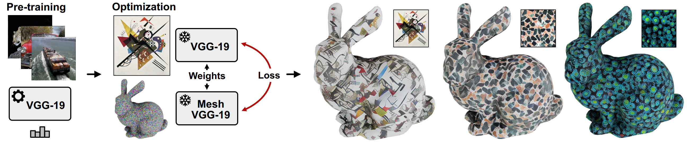

# Surface-aware Mesh Texture Synthesis with Pre-trained 2D CNNs
[Áron Samuel Kovács](https://www.cg.tuwien.ac.at/staff/AronKovacs), [Pedro Hermosilla](https://cvl.tuwien.ac.at/staff/pedro-hermosilla-casajus/), [Renata G. Raidou](https://www.cg.tuwien.ac.at/staff/RenataRaidou)




This repository contains the official implementation of the paper "Surface-aware Mesh Texture Synthesis with Pre-trained 2D CNNs."

Abstract: *Mesh texture synthesis is a key component in the automatic generation of 3D content. Existing learning-based methods have drawbacks—either by disregarding the shape manifold during texture generation or by requiring a large number of different views to mitigate occlusion-related inconsistencies. In this paper, we present a novel surface-aware approach for mesh texture synthesis that overcomes these drawbacks by leveraging the pre-trained weights of 2D Convolutional Neural Networks (CNNs) with the same architecture, but with convolutions designed for 3D meshes. Our proposed network keeps track of the oriented patches surrounding each texel, enabling seamless texture synthesis and retaining local similarity to classical 2D convolutions with square kernels. Our approach allows us to synthesize textures that account for the geometric content of mesh surfaces, eliminating discontinuities and achieving comparable quality to 2D image synthesis algorithms. Through qualitative and quantitative evaluations, we demonstrate that our approach works well for a variety of meshes and styles, producing visually appealing and consistent textures on meshes.*

## Running the code

You need to have Python 3 and at least Rust 1.70 installed. This implementation also requires CUDA.

Python 3 dependencies:

* Jinja>=3.0.3
* numpy>=1.19
* Pillow>=9.0
* pycuda>=2021.1
* tensorflow>=2.7
* xatlas>=0.0.6

Compile the Rust code with:
```
python setup.py install
```
There are two main Python scripts: `texture_synthesis.py` and `style_transfer.py`. To run them, you need to provide several command line parameters:
```
python texture_synthesis.py <path to .obj> <path to a style image> <texture width> <texture height>
python style_transfer.py <path to .obj> <path to a content image> <path to a style image>
```
Both scripts will output their texture results to the `generated_textures` folder.
In case the `save_progress` variable is set to `True`, they will also output the intermediate results to the `generated_textures/progress folder`.
Additionally, `texture_synthesis.py` outputs `.obj` meshes with UVs to the `objects_with_uvs` folder.

## BibTeX
```
TBD
```
